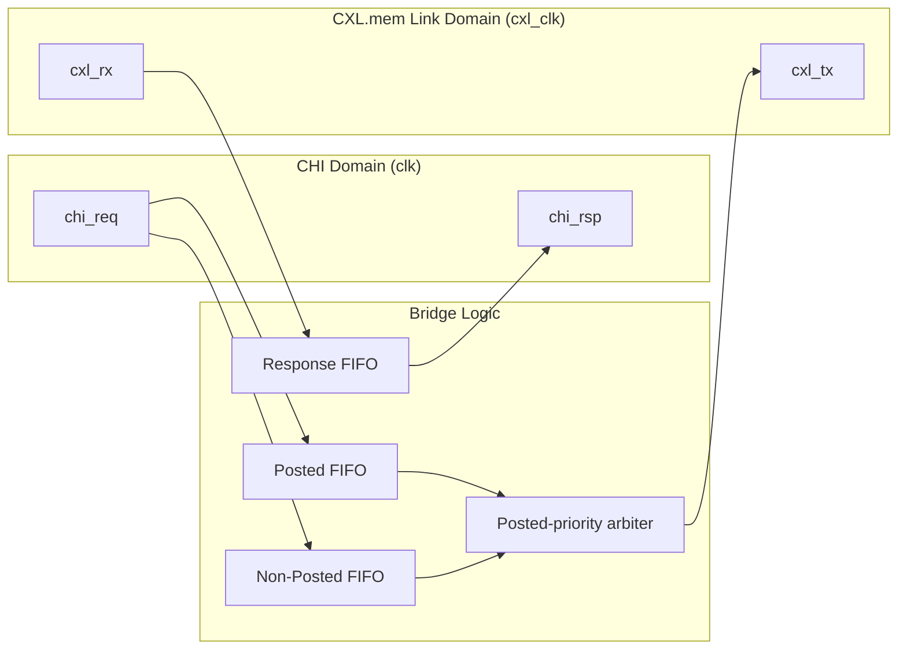

# CHI to CXL Bridge

Experimental **Verilog / SystemVerilog** RTL for a bridge between an **AMBA CHI**
host interface (a Request Node / interconnect port) and a **CXL.mem** link.

> **Status: scaffolding / early bring-up.** The translation datapath, dual-clock
> CDC, credit flow control, arbitration, and link-drain gating are implemented
> and verified (directed + stress sim, 100% line coverage, interface SVA, and
> SymbiYosys formal). The protocol model is a compact 64-bit abstraction, not a
> full CHI or CXL wire encoding — see [Known Limits](#known-limits) and
> [doc/PLAN.md](doc/PLAN.md) for the roadmap.

## Project Overview

The bridge accepts CHI requests on the host clock domain, translates each into a
single CXL.mem M2S flit, and crosses the two clock domains through **dual-clock
asynchronous FIFOs** with **per-class credit-based flow control**. CXL.mem S2M
responses returning from the link side are CRC-checked and reconstructed into CHI
response flits.



## Key Features

- **Dual-Clock Domain**: independent `clk` (CHI host) and `cxl_clk` (CXL link); all
  crossings via Gray-coded async FIFOs and 2-flop synchronizers.
- **Protocol Translation**: CHI `READ / WRITE / ATOMIC / DATALESS` requests map to
  CXL.mem M2S `MEMRD / MEMRDS / MEMWR / MEMWRPTL / MEMINV` flits; CXL S2M
  `DRS / NDR / DBID` responses map back to CHI `CompData / Comp / DBIDResp`.
- **Snoop path**: a CHI SNP request channel; since the CXL.mem device is
  memory-only (no cached copy), the bridge answers every snoop directly with
  `SnpResp` final state Invalid.
- **Credit Flow Control**: hardware-enforced credits per class — Posted,
  Non-Posted, Response — derived from async-FIFO write-domain occupancy, so credit
  state is inherently CDC-lossless (no toggle-pulse return path to drop).
- **Ordering Preservation**: posted-priority arbitration with a command lock so a
  selected flit drains before re-arbitration.
- **Integrity Checking**: CRC-8/CCITT on the link channel; a response with a bad
  checksum (or unknown kind) becomes a CHI **RespErr (INVALID)** response.
- **Link State Management**: a reset-drain FSM (`DOWN → UP → DRAIN → DOWN`) gates
  the bridge open only while the link is up and drains cleanly on link-down.
- **Verification**: directed + stress sim (Icarus) with a self-checking
  scoreboard across clock ratios (1:1, 2:1, 1:3); a **PyUVM-on-cocotb** tier
  (aligned with `../ucie2-pipe7-bridge/dv/pyuvm`) whose scoreboard cross-checks
  round-trip identity + request translation against an independent Python gold
  model; **functional coverage** (`cocotb_coverage`) at **100%** over the REQ/
  MemOpcode/RSP/CompData space; **Verilator `--coverage-line`** RTL line coverage
  (80% floor gated); a **bound SVA** checker verified under the pyuvm run
  (Verilator `--assert`); and SymbiYosys **formal** (`credit_counter`,
  `reset_drain`, the dual-clock `async_fifo` proven with unbounded
  `prove`/k-induction; the bridge top checked with BMC + cover).

## Architecture

| Path | Source Domain | Destination Domain | Buffer | Flow Control |
|:---|:---|:---|:---|:---|
| CHI posted request (`WRITE`) | `clk` | `cxl_clk` | `u_req_posted` async FIFO | `POSTED_CREDITS` |
| CHI non-posted request (`READ`, `ATOMIC`, `DATALESS`) | `clk` | `cxl_clk` | `u_req_np` async FIFO | `NP_CREDITS` |
| CXL.mem S2M response | `cxl_clk` | `clk` | `u_rsp` async FIFO | `RSP_CREDITS` |

The top-level packet model is a fixed 64-bit simulation format shared in both
directions:

| Bits | Field | Use |
|:---|:---|:---|
| `[63:60]` | Kind | CHI request/response kind or CXL M2S/S2M kind. |
| `[59:56]` | Code | Opcode / command sub-op / completion status. |
| `[55:48]` | Tag | CHI TxnID / CXL Tag (correlates requests and responses). |
| `[47:32]` | Address / byte count | 16-bit address (carried through unchanged); byte count on responses. |
| `[31:24]` | Length | Burst length / data size. |
| `[23:16]` | ID | CHI SrcID / CXL requester/completer ID. |
| `[15:8]` | Attributes | Snoop / order / cache-state attributes. |
| `[7:0]` | Misc / checksum | CRC-8/CCITT over header bytes `[63:8]`. |

### Opcode mapping

| CHI request | CXL.mem M2S | Class |
|:---|:---|:---|
| `READ` (ReadNoSnp) | `MEMRD` | non-posted |
| `READ` (ReadOnce) | `MEMRDS` (snooped/shared) | non-posted |
| `WRITE` (WriteNoSnp / WriteUnique) | `MEMWR` | posted |
| `WRITE` (WriteNoSnpPtl) | `MEMWRPTL` | posted |
| `ATOMIC` | `MEMINV` | non-posted |
| `DATALESS` (CMO) | `MEMINV` | non-posted |

| CXL.mem S2M | CHI response |
|:---|:---|
| `DRS` (MemData) | `CompData` |
| `NDR` (Cmp) | `Comp` |
| `DBID` | `DBIDResp` |
| bad CRC / unknown | `RespErr` (INVALID) |

## Module Map

| Module | Role |
|:---|:---|
| `src/chi_to_cxl_bridge.v` | Top-level translation, arbitration, credit, and link-gating integration. |
| `src/chi_to_cxl_bridge_defs.vh` | Packet constants, pack helpers, and CRC-8 checksum function. |
| `src/async_fifo.v` | Dual-clock first-word-fall-through FIFO with Gray-coded pointer CDC; exposes write-domain occupancy used for credit gating. |
| `src/cdc_sync.v` | Multi-flop level synchronizer for single-bit control crossings. |
| `src/reset_sync.v` | Asynchronous-assert / synchronous-deassert reset synchronizer. |
| `src/credit_counter.v` | Saturating credit availability counter (standalone, formally verified). |
| `src/credit_pulse_sync.v` | Toggle-based single-event pulse crossing (used for the CRC-error counter). |
| `src/reset_drain.v` | `DOWN / UP / DRAIN` link-state gate. |
| `src/chi_to_cxl_bridge_chk.v` | Simulation checker wrapper used by directed tests. |

## Quick Start

All standard gates are exposed from the repo root (`make help` lists them):

```bash
make regress     # Verilator lint + Icarus directed simulation (fast gate)
make stress      # directed sim with heavy backpressure
make pyuvm       # PyUVM-on-cocotb functional tier (round-trip + random, scoreboard cross-check)
make fcov        # independent functional coverage (cocotb_coverage); gates at 100%
make coverage    # Verilator --coverage-line on the pyuvm run (fails below 80% line floor)
make sva         # bound SVA checked under the pyuvm run (Verilator --assert)
make formal      # SymbiYosys: infra modules proven + bridge top bmc/cover
make synth       # Yosys synthesis smoke (catch latches, area stats)
make waves       # FST waveform of a pyuvm run -> build/waves/<MODULE>.fst
make trace-check # diff the canonical smoke trace against the committed golden
make ci          # regress + pyuvm + fcov + coverage + sva + formal + synth (comprehensive)
```

Per-area Makefiles also run standalone, e.g. `make -C verification/directed stress`,
`make -C verification/pyuvm MODULE=test_roundtrip`, or
`make -C verification/formal chi_to_cxl_bridge`.

> **PyUVM tier setup:** the cocotb/pyuvm bench (aligned with
> `../ucie2-pipe7-bridge/dv/pyuvm`) needs `cocotb` + `pyuvm` in the pip Python that
> `cocotb-config --python-bin` points at; `make fcov` additionally needs
> `cocotb_coverage`. See [verification/pyuvm/requirements.txt](verification/pyuvm/requirements.txt).

## Continuous Integration

`.github/workflows/ci.yml` runs a fast `regress` gate (lint + directed sim +
stress), then fans out to parallel jobs that each depend on it:

| Job | Command | Notes |
|:---|:---|:---|
| `regress` | `make regress && make stress` | Verilator lint + Icarus directed/stress |
| `pyuvm` | `make pyuvm` | PyUVM round-trip + random, scoreboard cross-check |
| `fcov` | `make fcov FCOV_SIM=icarus` | cocotb_coverage functional coverage; gates at 100% |
| `coverage` | `make coverage` | enforces 80% line floor; uploads `coverage.txt` |
| `sva` | `make sva` | bound SVA under Verilator `--assert` |
| `uvm-lint` | `make -C verification/uvm/vlt lint UVM_HOME=…` | elaborate the SV-UVM env (fetches the UVM fixture); RAM-safe |
| `formal` | `make formal` | SymbiYosys (pinned OSS CAD Suite) |
| `synth` | `make synth` | Yosys latch / area smoke |
| `verible` | `make verible-lint` | **advisory** style-lint (`continue-on-error`) |

## Documentation

- **Design Specification**: [doc/design-spec.md](doc/design-spec.md) — architecture, opcode mapping, packet format, FSM, and verification stack.
- **Coverage Plan**: [doc/coverage-plan.md](doc/coverage-plan.md) — code / functional / formal coverage levels and the functional model.
- **PyUVM tier**: [verification/pyuvm/](verification/pyuvm/) — env, agent, sequences, and tests (aligned with `../ucie2-pipe7-bridge/dv/pyuvm`).
- **SV-UVM tier**: [verification/uvm/](verification/uvm/) — a SystemVerilog UVM env on the `chi_to_cxl_if` bundle (`make -C verification/uvm/vlt lint UVM_HOME=…`); elaborates on OSS Verilator, `--binary` run on a large runner.
- **Plan**: [doc/PLAN.md](doc/PLAN.md) — current state and phased roadmap.

## Known Limits

| Area | Current Limit |
|:---|:---|
| Protocol compliance | The 64-bit packet format is a compact model, not a full CHI or CXL.mem wire encoding (no flit framing, no separate REQ/RSP/DAT/SNP channel widths). |
| Snoops | A minimal CHI SNP path is modeled: the memory-only device answers every snoop `SnpResp` Invalid. A full coherency state machine (tracking cached lines) is out of scope. |
| Payload data | Header/control fields are modeled; multi-beat data payload transport is not implemented. |
| Atomics | `ATOMIC` is modeled as a single `MEMINV`-class flit; atomic compare/arithmetic semantics are not executed. |
| Link training | `link_up` is an external input consumed by the reset-drain FSM; PHY/link training is out of scope. |

---
*Experimental RTL — for educational and prototyping purposes.*
